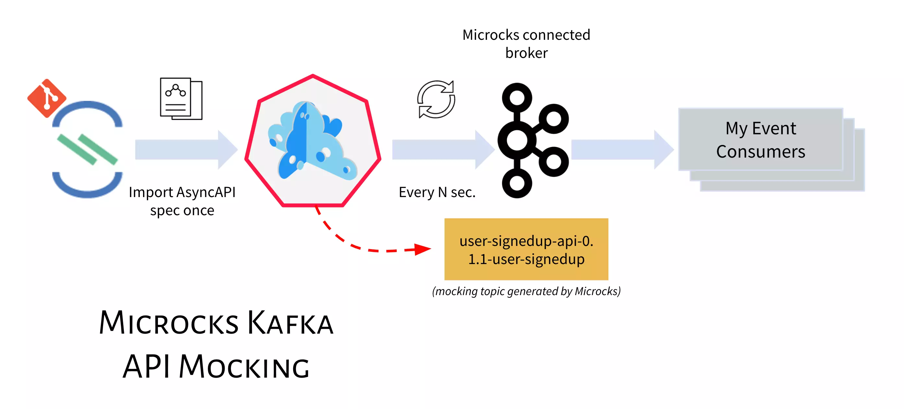
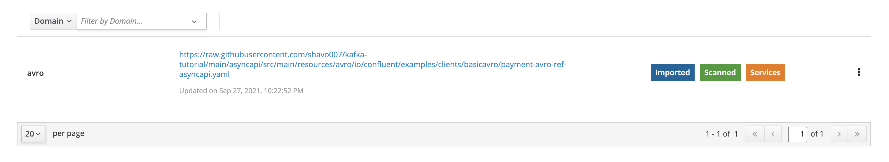
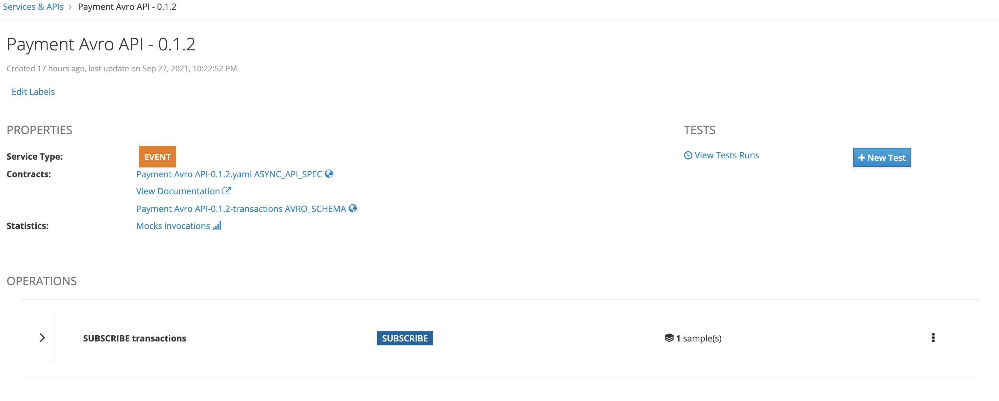

# Microcks with async API



**NB**: rather than use the microcks example I have amended it so you can run schema registry and publish messages using avro schema

```bash
cd docker-compose
docker-compose -f docker-compose.yml -f docker-compose-async-addon.yml up -d
docker ps
```

-- OR --

```bash
docker rmi quay.io/microcks/microcks:latest quay.io/microcks/microcks-async-minion:latest quay.io/microcks/microcks-postman-runtime:latest
git clone https://github.com/microcks/microcks
cd microcks/install/docker-compose
docker-compose -f docker-compose.yml -f docker-compose-async-addon.yml up -d
docker ps
```

Verify topics created
`kcat -b localhost:9092 -L`

## Need to add a scheduled importer as you need to import 2 files (async API and avro schema)



<https://raw.githubusercontent.com/shavo007/kafka-tutorial/main/asyncapi/src/main/resources/avro/io/confluent/examples/clients/basicavro/payment-avro-ref-asyncapi.yaml>

## Service

You should then be able to visualise the imported service



Microcks will now start to publish messages to the topic and automatically deploy schema to the registry.

## Lets verify this

```bash
kcat -b localhost:9092 -t PaymentAvroAPI-0.1.2-transactions -s value=avro -r http://localhost:8888  -o end

#verify schema
curl --silent -X GET http://localhost:8888/subjects/PaymentAvroAPI-0.1.2-transactions-io.confluent.examples.clients.basicavro.Payment/versions/latest | jq .
curl --silent -X GET http://localhost:8888/schemas/ids/1 | jq .
```

## Resources

- <https://microcks.io/blog/async-features-with-docker-compose/>
- <https://microcks.io/documentation/guides/avro-messaging/>
