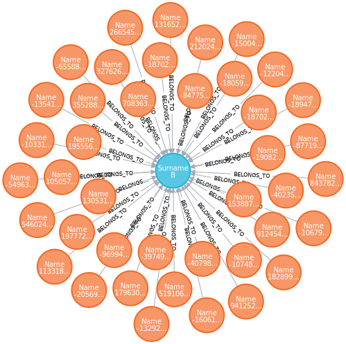

# Kafa connect

## Create topics

```bash
docker exec broker \
kafka-topics --bootstrap-server broker:9092 \
             --create \
             --topic pageviews \

docker exec broker \
kafka-topics --bootstrap-server broker:9092 \
             --create \
             --topic users

#create connector
curl -X POST http://localhost:8083/connectors \
  -H 'Content-Type:application/json' \
  -H 'Accept:application/json' \
  -d @contrib.sink.avro.neo4j.json

#pageviews
curl -X POST http://localhost:8083/connectors \
  -H 'Content-Type:application/json' \
  -H 'Accept:application/json' \
  -d @contrib.datagen-pageview.avro.json

#users
curl -X POST http://localhost:8083/connectors \
  -H 'Content-Type:application/json' \
  -H 'Accept:application/json' \
  -d @datagen_users_oss.json


curl -s  http://localhost:8083/connectors | jq '.'
curl -s http://localhost:8083/connector-plugins | jq '.'

 curl -s "http://localhost:8083/connectors?expand=info&expand=status" | \
  jq '. | to_entries[] | [ .value.info.type, .key, .value.status.connector.state,.value.status.tasks[].state, .value.info.config."connector.class"] |join(":|:")' | \
  column -s : -t| sed 's/\"//g'| sort


kcat -b localhost:9092 -t pageviews -s value=avro -r http://localhost:8081
kcat -b localhost:9092 -t users -s value=avro -r http://localhost:8081

# generate users
java -jar neo4j-streams-sink-tester-1.0.jar -f AVRO
kcat -b localhost:9092 -t my-topic -s value=avro -r http://localhost:8081

# Access neo4j at `http://localhost:7474`
# username: neo4j pwd:connect
# run cmd `MATCH p=()-->() RETURN p LIMIT 25`

 curl -s -XDELETE "http://localhost:8083/connectors/Neo4jSinkConnector"
 curl -s -XDELETE "http://localhost:8083/connectors/datagen-users"
 curl -s -XDELETE "http://localhost:8083/connectors/datagen-pageviews"

```



## Debezium

```bash
mysql -h 0.0.0.0 -uroot -pdebezium
use inventory;
show tables;
SELECT * from customers;

#After the connector is registered, it will start monitoring the database server’s binlog and it will generate change events for each row that changes.
curl -X POST http://localhost:8083/connectors \
  -H 'Content-Type:application/json' \
  -H 'Accept:application/json' \
  -d @mysql-inventory.json
curl -s  http://localhost:8083/connectors | jq '.'
curl -s http://localhost:8083/connector-plugins | jq '.'

kcat -L -b localhost:9092 | grep dbserver
kcat -b localhost:9092  -t dbserver1.inventory.customers -J

curl -s -XDELETE "http://localhost:8083/connectors/inventory-connector"

```

### Topics

**dbserver1**
The schema change topic to which all of the DDL statements are written.

**dbserver1.inventory.products**
Captures change events for the products table in the inventory database.

**dbserver1.inventory.products_on_hand**
Captures change events for the products_on_hand table in the inventory database.

**dbserver1.inventory.customers**
Captures change events for the customers table in the inventory database.

**dbserver1.inventory.orders**
Captures change events for the orders table in the inventory database.


### Updating database and viewing the event

```bash
docker-compose exec mysql sh
mysql -h 0.0.0.0 -uroot -pdebezium
use inventory;
show tables;
SELECT * from customers;
UPDATE customers SET first_name='Anne Marie' WHERE id=1004;
```

```json
{
  "topic": "dbserver1.inventory.customers",
  "partition": 0,
  "offset": 4,
  "tstype": "create",
  "ts": 1633995733414,
  "broker": 1,
  "key": "{\"schema\":{\"type\":\"struct\",\"fields\":[{\"type\":\"int32\",\"optional\":false,\"field\":\"id\"}],\"optional\":false,\"name\":\"dbserver1.inventory.customers.Key\"},\"payload\":{\"id\":1004}}",
  "payload": "{\"schema\":{\"type\":\"struct\",\"fields\":[{\"type\":\"struct\",\"fields\":[{\"type\":\"int32\",\"optional\":false,\"field\":\"id\"},{\"type\":\"string\",\"optional\":false,\"field\":\"first_name\"},{\"type\":\"string\",\"optional\":false,\"field\":\"last_name\"},{\"type\":\"string\",\"optional\":false,\"field\":\"email\"}],\"optional\":true,\"name\":\"dbserver1.inventory.customers.Value\",\"field\":\"before\"},{\"type\":\"struct\",\"fields\":[{\"type\":\"int32\",\"optional\":false,\"field\":\"id\"},{\"type\":\"string\",\"optional\":false,\"field\":\"first_name\"},{\"type\":\"string\",\"optional\":false,\"field\":\"last_name\"},{\"type\":\"string\",\"optional\":false,\"field\":\"email\"}],\"optional\":true,\"name\":\"dbserver1.inventory.customers.Value\",\"field\":\"after\"},{\"type\":\"struct\",\"fields\":[{\"type\":\"string\",\"optional\":false,\"field\":\"version\"},{\"type\":\"string\",\"optional\":false,\"field\":\"connector\"},{\"type\":\"string\",\"optional\":false,\"field\":\"name\"},{\"type\":\"int64\",\"optional\":false,\"field\":\"ts_ms\"},{\"type\":\"string\",\"optional\":true,\"name\":\"io.debezium.data.Enum\",\"version\":1,\"parameters\":{\"allowed\":\"true,last,false\"},\"default\":\"false\",\"field\":\"snapshot\"},{\"type\":\"string\",\"optional\":false,\"field\":\"db\"},{\"type\":\"string\",\"optional\":true,\"field\":\"sequence\"},{\"type\":\"string\",\"optional\":true,\"field\":\"table\"},{\"type\":\"int64\",\"optional\":false,\"field\":\"server_id\"},{\"type\":\"string\",\"optional\":true,\"field\":\"gtid\"},{\"type\":\"string\",\"optional\":false,\"field\":\"file\"},{\"type\":\"int64\",\"optional\":false,\"field\":\"pos\"},{\"type\":\"int32\",\"optional\":false,\"field\":\"row\"},{\"type\":\"int64\",\"optional\":true,\"field\":\"thread\"},{\"type\":\"string\",\"optional\":true,\"field\":\"query\"}],\"optional\":false,\"name\":\"io.debezium.connector.mysql.Source\",\"field\":\"source\"},{\"type\":\"string\",\"optional\":false,\"field\":\"op\"},{\"type\":\"int64\",\"optional\":true,\"field\":\"ts_ms\"},{\"type\":\"struct\",\"fields\":[{\"type\":\"string\",\"optional\":false,\"field\":\"id\"},{\"type\":\"int64\",\"optional\":false,\"field\":\"total_order\"},{\"type\":\"int64\",\"optional\":false,\"field\":\"data_collection_order\"}],\"optional\":true,\"field\":\"transaction\"}],\"optional\":false,\"name\":\"dbserver1.inventory.customers.Envelope\"},\"payload\":{\"before\":{\"id\":1004,\"first_name\":\"Anne\",\"last_name\":\"Kretchmar\",\"email\":\"annek@noanswer.org\"},\"after\":{\"id\":1004,\"first_name\":\"Anne Marie\",\"last_name\":\"Kretchmar\",\"email\":\"annek@noanswer.org\"},\"source\":{\"version\":\"1.7.0.Final\",\"connector\":\"mysql\",\"name\":\"dbserver1\",\"ts_ms\":1633995732000,\"snapshot\":\"false\",\"db\":\"inventory\",\"sequence\":null,\"table\":\"customers\",\"server_id\":223344,\"gtid\":null,\"file\":\"mysql-bin.000003\",\"pos\":400,\"row\":0,\"thread\":null,\"query\":null},\"op\":\"u\",\"ts_ms\":1633995732781,\"transaction\":null}}"
}
```

Example of the events value

```json
{
  "schema": {...},
  "payload": {
    "before": {
      "id": 1004,
      "first_name": "Anne",
      "last_name": "Kretchmar",
      "email": "annek@noanswer.org"
    },
    "after": {
      "id": 1004,
      "first_name": "Anne Marie",
      "last_name": "Kretchmar",
      "email": "annek@noanswer.org"
    },
    "source": {
      "name": "1.7.0.Final",
      "name": "dbserver1",
      "server_id": 223344,
      "ts_sec": 1486501486,
      "gtid": null,
      "file": "mysql-bin.000003",
      "pos": 364,
      "row": 0,
      "snapshot": null,
      "thread": 3,
      "db": "inventory",
      "table": "customers"
    },
    "op": "u",
    "ts_ms": 1486501486308
  }
}
```

### Deleting a record in the database and viewing the delete event

```bash
DELETE FROM addresses WHERE customer_id=1004;
DELETE FROM customers WHERE id=1004;
```

By deleting a row in the customers table, the Debezium MySQL connector generated two new events.

> The last event is called a `tombstone` event, because it has a key and an empty value. This means that Kafka will remove all prior messages with the same key. Even though the prior messages will be removed, the tombstone event means that consumers can still read the topic from the beginning and not miss any events.

### Avro example

<https://github.com/debezium/debezium-examples/tree/master/tutorial#using-mysql-and-the-avro-message-format>

```bash
#delete the existing connector

curl -s -XDELETE "http://localhost:8083/connectors/inventory-connector"

docker exec broker \
kafka-topics --bootstrap-server broker:9092 \
             --delete \
             --topic 'dbserver1.*'

curl -X POST http://localhost:8083/connectors \
  -H 'Content-Type:application/json' \
  -H 'Accept:application/json' \
  -d @mysql-inventory-avro.json

curl -s  http://localhost:8083/connectors | jq '.'
curl -s http://localhost:8081/subjects | jq '.'

docker-compose exec mysql sh
mysql -h 0.0.0.0 -uroot -pdebezium
use inventory;
show tables;
SELECT * from customers;
UPDATE customers SET first_name='Anne Marie' WHERE id=1003;

#consume messages from topic and des via schema registry
kcat -b localhost:9092 -t dbserver1.inventory.customers -s value=avro -r http://localhost:8081
#view schema from schema registry
curl -X GET http://localhost:8081/subjects/dbserver1.inventory.customers-value/versions/1 | jq '.schema | fromjson'


```

## Resources

[Connect datagen](https://github.com/confluentinc/kafka-connect-datagen)

[debezium json schema](https://debezium.io/documentation/faq/#why_do_json_messages_not_contain_schema)

[kafka connect and serdes explained](https://www.confluent.io/blog/kafka-connect-deep-dive-converters-serialization-explained/)

[Debezium and avro](https://debezium.io/blog/2016/09/19/Serializing-Debezium-events-with-Avro/)
