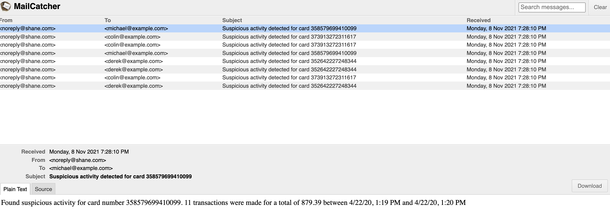

# Showcase ksqldb with an event driven microservice

Imagine that you work at a financial services company which clears many credit card transactions each day. You want to prevent malicious activity in your customer base. When a high number of transactions occurs in a narrow window of time, you want to notify the cardholder of suspicious activity.

This tutorial shows how to create an event-driven microservice that identifies suspicious activity and notifies customers. It demonstrates finding anomalies with ksqlDB and sending alert emails using a simple Kafka consumer with SendGrid.

```bash
#create stream
CREATE STREAM transactions (
    tx_id VARCHAR KEY,
    email_address VARCHAR,
    card_number VARCHAR,
    timestamp VARCHAR,
    amount DECIMAL(12, 2)
) WITH (
    kafka_topic = 'transactions',
    partitions = 8,
    value_format = 'avro',
    timestamp = 'timestamp',
    timestamp_format = 'yyyy-MM-dd''T''HH:mm:ss'
);

INSERT INTO transactions (
    email_address, card_number, tx_id, timestamp, amount
) VALUES (
    'michael@example.com',
    '358579699410099',
    'f88c5ebb-699c-4a7b-b544-45b30681cc39',
    '2020-04-22T03:19:58',
    50.25
);

INSERT INTO transactions (
    email_address, card_number, tx_id, timestamp, amount
) VALUES (
    'derek@example.com',
    '352642227248344',
    '0cf100ca-993c-427f-9ea5-e892ef350363',
    '2020-04-22T12:50:30',
    18.97
);

INSERT INTO transactions (
    email_address, card_number, tx_id, timestamp, amount
) VALUES (
    'colin@example.com',
    '373913272311617',
    'de9831c0-7cf1-4ebf-881d-0415edec0d6b',
    '2020-04-22T09:45:15',
    12.50
);

INSERT INTO transactions (
    email_address, card_number, tx_id, timestamp, amount
) VALUES (
    'michael@example.com',
    '358579699410099',
    '044530c0-b15d-4648-8f05-940acc321eb7',
    '2020-04-22T03:19:54',
    103.43
);

INSERT INTO transactions (
    email_address, card_number, tx_id, timestamp, amount
) VALUES (
    'derek@example.com',
    '352642227248344',
    '5d916e65-1af3-4142-9fd3-302dd55c512f',
    '2020-04-22T12:50:25',
    3200.80
);

INSERT INTO transactions (
    email_address, card_number, tx_id, timestamp, amount
) VALUES (
    'derek@example.com',
    '352642227248344',
    'd7d47fdb-75e9-46c0-93f6-d42ff1432eea',
    '2020-04-22T12:51:55',
    154.32
);

INSERT INTO transactions (
    email_address, card_number, tx_id, timestamp, amount
) VALUES (
    'michael@example.com',
    '358579699410099',
    'c5719d20-8d4a-47d4-8cd3-52ed784c89dc',
    '2020-04-22T03:19:32',
    78.73
);

INSERT INTO transactions (
    email_address, card_number, tx_id, timestamp, amount
) VALUES (
    'colin@example.com',
    '373913272311617',
    '2360d53e-3fad-4e9a-b306-b166b7ca4f64',
    '2020-04-22T09:45:35',
    234.65
);

INSERT INTO transactions (
    email_address, card_number, tx_id, timestamp, amount
) VALUES (
    'colin@example.com',
    '373913272311617',
    'de9831c0-7cf1-4ebf-881d-0415edec0d6b',
    '2020-04-22T09:44:03',
    150.00
);

#aggregate using a table
CREATE TABLE possible_anomalies WITH (
    kafka_topic = 'possible_anomalies',
    VALUE_AVRO_SCHEMA_FULL_NAME = 'io.ksqldb.tutorial.PossibleAnomaly'
)   AS
    SELECT card_number AS `card_number_key`,
           as_value(card_number) AS `card_number`,
           latest_by_offset(email_address) AS `email_address`,
           count(*) AS `n_attempts`,
           sum(amount) AS `total_amount`,
           collect_list(tx_id) AS `tx_ids`,
           WINDOWSTART as `start_boundary`,
           WINDOWEND as `end_boundary`
    FROM transactions
    WINDOW TUMBLING (SIZE 30 SECONDS, RETENTION 1000 DAYS)
    GROUP BY card_number
    HAVING count(*) >= 3
    EMIT CHANGES;

SELECT * FROM possible_anomalies EMIT CHANGES;

#view schema
curl --silent http://localhost:8081/subjects/possible_anomalies-value/versions/latest | jq '.'
```

## Microservice app

>Instead of sendgrid lets use mailcatcher

```bash
 docker run -d -p 1080:1080 -p 1025:1025 --name mailcatcher schickling/mailcatcher
 access UI at http://127.0.0.1:1080/
```

```bash
./mvnw clean install
./mvnw schema-registry:download #download the avro schema from registry
./mvnw generate-sources #generate the models from the avro schema
./mvnw exec:java -Dexec.mainClass="io.ksqldb.tutorial.EmailSender" #run the class
#insert in some transactions again and view the emails sent out
```



## Resources

<https://docs.ksqldb.io/en/latest/tutorials/event-driven-microservice/#event-driven-microservice>
